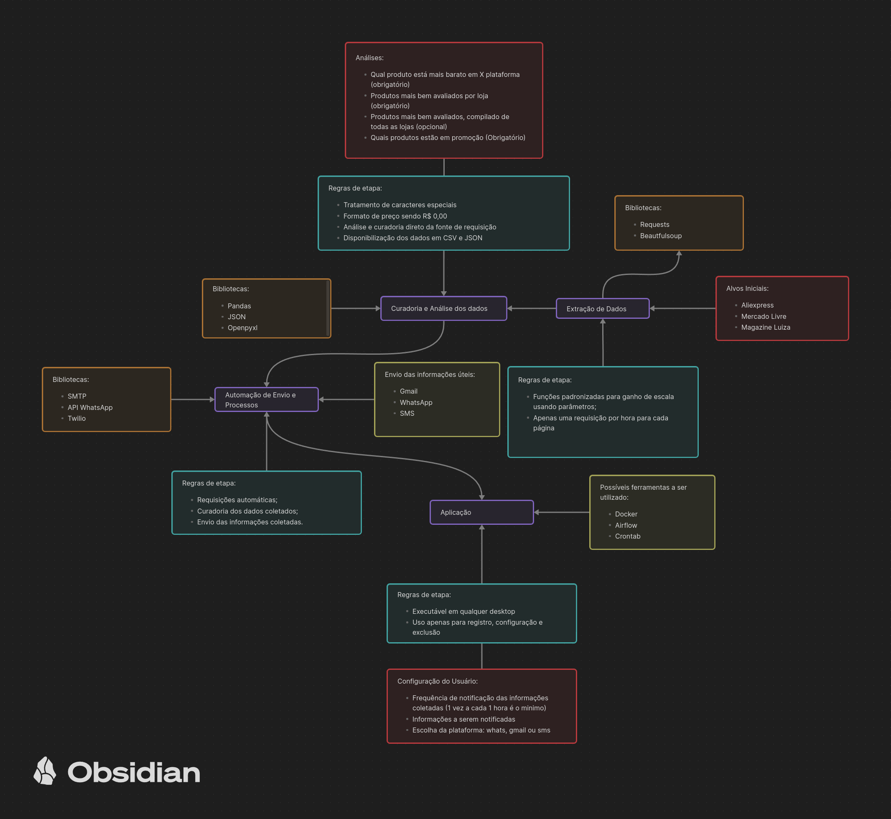

# PromoHunter
### Tópicos:
- [Backlog de atividades](backlog.md)
- [Conceito do projeto](#conceito-do-projeto)
- [Canvas do Projeto](#canvas-do-projeto)
- [Tecnologias ETL](#tecnologias-a-serem-utilizadas-etl)
- [Tecnologias Aplicação](#tecnologias-a-serem-utilizadas-aplicação)

## Conceito do projeto
ETL tendo como alvo o e-commerce de varejos onde será coletado inicialmente dados sobre os produtos, com a coleta realizada teremos a análise dos dados onde temos como objetivo a comparação de qual produto está mais barato e disponível para compra no momento da requisição, com a análise feita, será notificado em alguma canal de comunicação ao usuário final. 

## Canvas do projeto

## Tecnologias a serem utilizadas (ETL)
### Extração de dados:
- Requests
- Beautifulsoup
- Process
- JSON

### Análise de dados:
- Pandas
- Openpyxl
- JSON

### Carregamento dos Dados:
- CSV
- JSON

### Canais de Envio dos Dados:
- Gmail (SMTP)
- SMS (API Twilio)
- WhatsApp (API WhatsApp)

## Tecnologias a serem utilizadas (Aplicação)
- Docker
- Airflow
- Crontab